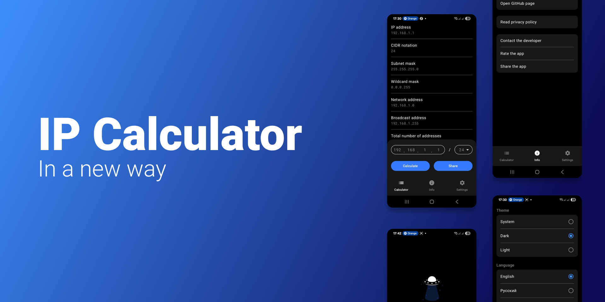
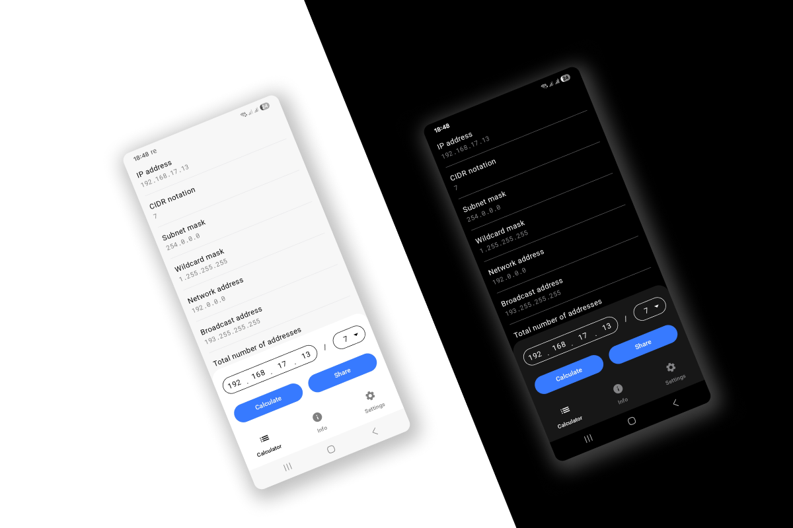
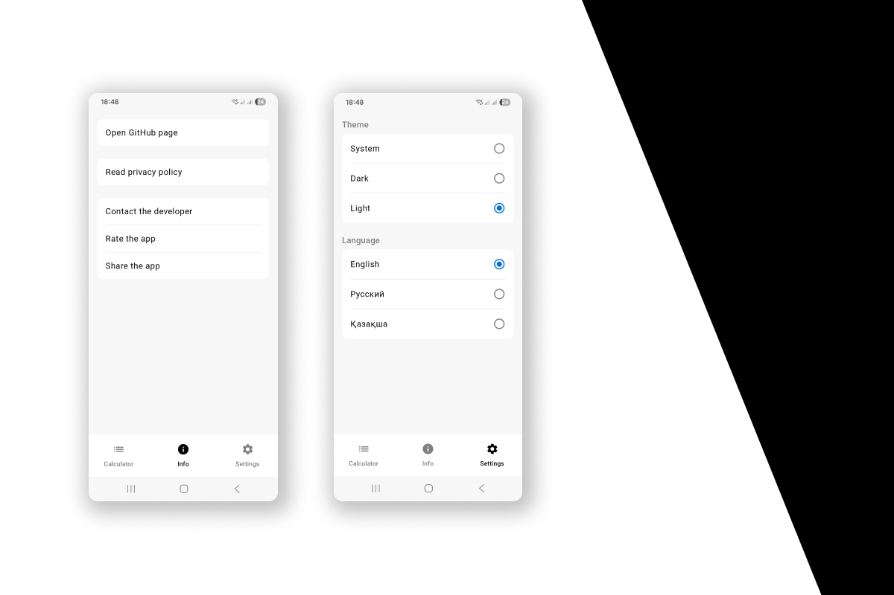
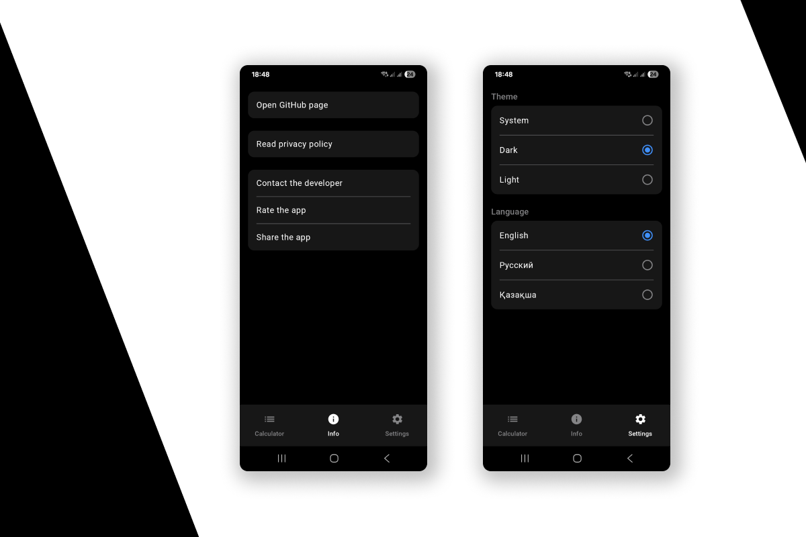
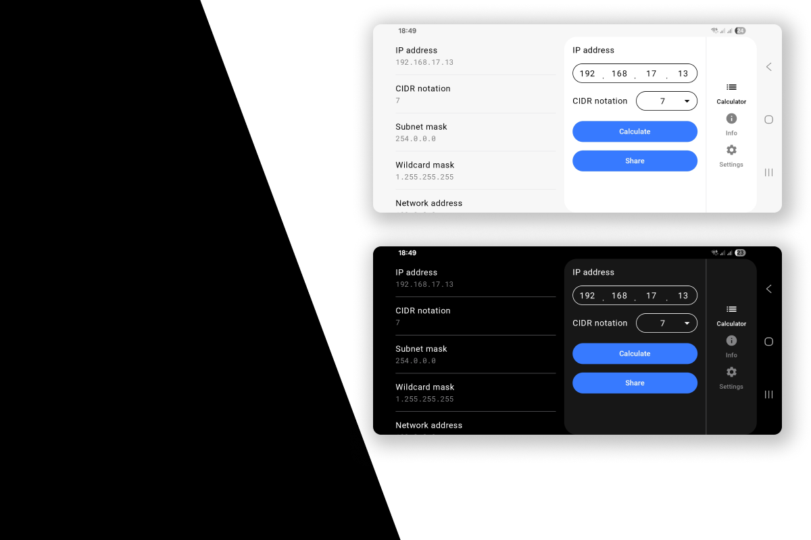

IP Calculator
==================

The IP calculator allows you to determine the network IP address, broadcast address, first host IP address, last host IP address, the number of usable hosts in the given network, the subnet mask, the wildcard mask, and the network prefix.

You can share the result via messenger or simply copy it as text.

Everything you need to calculate and view the obtained information is available on a single screen. We’ve tried to save your time.

## Screenshots

## Acknowledgments
Special thanks for the help with the Kazakh translation: [Nuray Turganbayeva (System Analyst)](https://www.linkedin.com/in/nuray-turganbayeva/)

## Bugs / Questions / Suggestions

📧 [Write to me and I will fix / reply / add details as soon as possible](mailto:developer.kaczmarek@gmail.com)

## Privacy policy
* The app does not require user registration. The app does not ask the user to provide any personal information. You can read the full privacy policy [here](https://github.com/developer-kaczmarek/IpCalculator/wiki/Privacy-policy).
